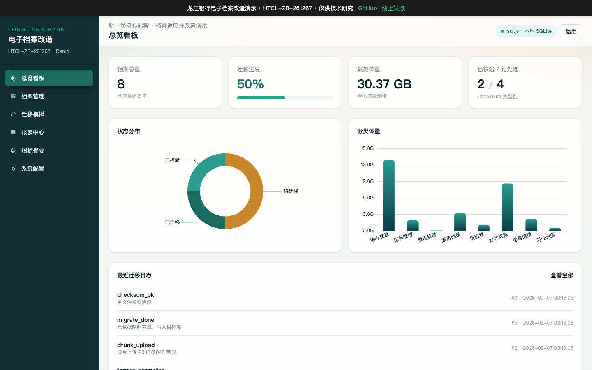

# 龙江银行电子档案系统改造演示



- **在线演示**：https://26-lb-arc-bid.softwarelink.net/
- **代码仓库**：https://github.com/softwarelink-net/26-lb-arc-bid

## 🚀 部署与运行说明

### 环境要求
- Node.js >= 18.0.0
- npm >= 9.0.0 或 yarn >= 1.22.0

### 安装
```bash
git clone https://github.com/softwarelink-net/26-lb-arc-bid.git
cd 26-lb-arc-bid
npm install
```

### 本地运行
```bash
npm run dev
```
本地访问地址：http://localhost:5173

### 演示账号
- **管理员（Admin）**：admin / admin123
- **档案员（Archivist）**：archivist / archivist123
- **审计员（Auditor）**：auditor / auditor123

### 常用脚本
- `npm run build`：生产环境构建
- `npm run lint`：代码检查
- `npm run preview`：本地预览生产构建
- `npm run deploy`：构建并上传至 Cloudflare R2（Allworld）

### 目录结构
```text
├── src/
│   ├── assets/          # 静态资源
│   ├── components/      # 可复用 UI 组件
│   ├── layouts/         # AuthLayout、MainLayout
│   ├── router/          # Vue Router 路由配置
│   ├── stores/          # Pinia 状态管理
│   ├── views/           # 页面组件
│   └── utils/           # 工具函数（sql.js 封装等）
├── public/              # 公共静态文件
├── docs/                # 文档资源
├── index.html           # 入口 HTML
└── package.json
```

## 📢 招标公告全文

### 标题
龙江银行新一代核心系统建设项目-电子档案系统改造人力外包服务采购项目（四次）公开招标公告

### 采购人
龙江银行股份有限公司

### 项目编号
HTCL-ZB-261267

### 发布日期
2026-09-03

### 关键词
龙江银行、电子档案系统、核心系统改造、人力外包、HTCL-ZB-261267、招标公告

### 摘要
龙江银行发布新一代核心系统建设项目-电子档案系统改造人力外包服务采购项目（四次）公开招标公告，预算 28.8 万元。内容涵盖 5 个模块适配开发、协议联调、文件批量/分片上传功能改造、全量历史档案存量数据迁移、数据校验、格式统一、单元/集成/压力测试、版本上线支持，以及报表字段与逻辑优化。预估工作量不少于 12 人月。

### 技术要点
- 5 个模块适配开发
- 系统文件批量上传、分片上传功能改造
- 全量历史档案存量数据迁移与校验
- 6 个批量接口与 8 个文件接口开发联调
- 报表改造 66 个

### 技术亮点
- 在不变更现有技术架构的前提下完成无缝适配
- 面向大体量档案文件的高效分片上传机制
- 迁移过程中的自动化数据校验与格式标准化

## 免声明

1. **数据来源与合规性**：本项目所涉数据信息均采集自互联网公开渠道发布的标讯公示信息。项目开发者严格遵守《中华人民共和国数据安全法》及相关法律法规，确保数据来源合法、公开、可查询。
2. **技术实现路径**：本项目核心内容系基于国产大语言模型进行算法推演与自动化构造生成，非直接引用或复制原始招标文件。
3. **保密承诺**：本项目郑重承诺：不涉及、不包含任何国家秘密、商业秘密或未公开的敏感信息。所有生成内容均基于公开数据的逻辑推演。
4. **知识产权与巧合声明**：鉴于本项目内容均由AI模型基于公开数据推演生成，若生成内容在表述方式、结构逻辑上与任何第三方原始标书文件存在相似之处，纯属技术推演之巧合，不构成对任何第三方著作权的侵犯或商业秘密的泄露。本项目不保证生成内容的准确性与完整性，仅供技术研究与学习参考。
5. **免责条款**：任何单位或个人使用本项目代码及生成内容所产生的一切后果，均由使用者自行承担，项目开发者不承担任何法律责任。
